# TestConductor v4：从测试设计到线性执行计划

本文是第一层 `TestDesign.v4`、第二层 `TestPlan.v4` 和第三层执行交接的当前审计契约。
旧版设计和兼容层已删除，本文只描述当前 v4 链路。

产品界面名称与内部契约名称并不相同：用户提交“测试意图”，第一层 `TestDesign.v4` 显示为
“测试计划”；第二层 `TestPlan.v4` 显示为“执行计划”。后文保留内部契约名，避免与代码字段混淆。

## 1. 为什么需要两次受审编译

需求描述业务行为，执行器需要目标环境中的实现事实。模型可以理解自然语言并提出测试
设计，但不能可靠知道当前 API path、数据库 query、页面能力、性能 profile 或 cleanup
handler。把这些内容交给同一次模型自由生成，会得到看似完整、实际无法验证来源的脚本。

```mermaid
flowchart LR
    A["Raw requirements + frontend selections"] --> B["Input snapshot and gates"]
    K["Optional approved knowledge"] --> C["TestDesignCandidate model"]
    B --> C
    C --> D["System ID compile + deterministic validation"]
    D --> E["Human TestDesign review"]
    E --> F["ApprovedTestDesignBundle.v4"]
    F --> R["Resolve selected test resources"]
    R --> P["PlanningCatalogSnapshot.v4"]
    P --> G["PlanCandidate model"]
    G --> H["System flow/stage compile + artifact validation"]
    H --> I["Human TestPlan and artifact review"]
    I --> J["ApprovedTestPlanBundle.v4"]
    J --> R["Channel-specific runners"]
```



两个模型都只产生 candidate。系统负责 ID、引用解析、typed execution、hash 和状态；人工
审核负责语义批准。任何一方都不能跳过另一方直接把 candidate 当作可执行计划。

## 2. 全链路输入和输出

| 阶段 | 输入 | 处理 | 输出 |
| --- | --- | --- | --- |
| 第一层输入 | 原始 requirements、target、selections、可选知识 scope | 大小/秘密/ID 门禁，锁定原文与完整输入 hash | `TestDesignInputSnapshot` |
| 第一层模型 | 输入快照对应的原文、选择和 approved knowledge | 语义归类、测试技术扩展、逻辑场景设计 | `TestDesignCandidate` |
| 第一层系统 | candidate + request | 生成领域 ID，把 1-based 索引编译为稳定引用 | draft `TestDesign.v4` |
| 第一层审核 | design + input snapshot + validation | 人工核对原文支持、推导、状态影响和 cleanup | `ApprovedTestDesignBundle.v4` |
| 第二层输入 | approved design + 测试资源配置 | 精确读取正式格式；由模型整理网页 Agent、宽松接口、数据库和性能资料；统一生成 Catalog | 锁定的 planning 上下文 |
| 第二层模型 | approved design 投影 + Catalog 投影 | 生成资源约束内的 ref、数据绑定、完整 SQL、读写策略、性能阶段和 stage 顺序 | `PlanCandidate` |
| 第二层系统 | candidate + approved bundle + Catalog | 生成 flow/stage ID，解析 typed execution，编译 provisional artifacts | draft `TestPlan.v4` + artifacts |
| 第二层审核 | plan + validation + artifact set | 人工核对映射、顺序、参数和最终产物 | `ApprovedTestPlanBundle.v4` |
| 第三层 | approved plan bundle + RuntimeContext | 身份门禁、顺序执行、一次 cleanup、证据落盘 | `run-manifest.v4` |

第二层模型不会重新看到完整 input snapshot、知识审批意见或第一层 review comments，也不会
重新解释原始需求。它消费的是已经批准的逻辑设计和执行 Catalog。

## 3. 第一层契约

### 3.1 输入不固定，输出固定

`TestDesignRequest.v4` 的 requirement 内容始终是原始字符串。它可以没有标题和编号，也可以
包含 Markdown、表格文本、任意编号或 JSON；TestConductor 不先把它切成 heading/table/list，
也不声称能从提取文本还原 PDF 页码或 XLSX 单元格。

```text
requirements[]: requirement_id? + content
target: system_id + environment
selections:
  techniques[]
  allowed_channels[]
  required_channels[]?  # 可选的强制覆盖渠道
  knowledge_scope_ids[]
```

Target 和 selections 由前端/调用方拥有，模型没有这些输出字段。可选知识只能来自已审批
resolver；Catalog 是另一类知识，不能通过第一层 RAG 文本代替。

### 3.2 Candidate 与系统编译

模型候选负责业务语义：

```text
title / objective / in_scope / out_of_scope
scenario.title / techniques / requirement_ids
required_states
operations[].text + channel_hint
expected_results[].text + after_operation_index + channel_hint
data_requirements[].text + constraints
state_impact + rationale + cleanup_goal.subject_data_indexes
open_questions
```

候选 schema 不包含 `design_id`、`scenario_id`、任何领域 ID、version、status 或 blocking。
系统按 approved 列表顺序生成：

```text
scenario_id
required_state_id
operation_id
expected_result_id + after_operation_id
data_id
cleanup_goal_id + subject_data_ids
question_id
```

`objective`、scope、constraint、rationale 和 derivation note 使用无 ID 的 `DesignText`。
它们没有下游引用者时不制造通用 `STMT-*`。

### 3.3 第一层字段消费

| 字段 | 来源 | 第二层用途 | 第三层用途 |
| --- | --- | --- | --- |
| `design_id/version/status` | 系统/审核状态机 | 身份与 approved 门禁 | artifact/run 身份 |
| `target` | 前端 | Catalog target 硬匹配 | 通过 runtime refs 落实 |
| 顶层 `title` | 模型 + 人工审核 | 第二层模型上下文 | 不硬消费 |
| `scenario.title` | 模型 + 人工审核 | flow 名称、artifact 展示名 | UI 适配器未来的 case/报告展示 |
| `objective/scope` | 模型 + 人工审核 | 计划模型上下文 | 不硬消费 |
| `techniques` | 前端约束，模型场景归类 | 原样保存、覆盖审计 | 报告追溯，不驱动 runner |
| `requirement_ids` | 模型声明 + 人工审核 | flow 必须原样保留 | UI/其他报告追溯 |
| `required_state_id/text` | 模型语义 + 系统 ID | 必须解析为 data 或 setup | setup stage 或运行时显式保证 |
| `operation_id/text/channel_hint` | 模型语义 + 系统 ID | catalog mapping、stage 路由和顺序 | typed operation；UI 文本当前留在 plan/manifest 追溯 |
| `expected_result_id/after_operation_id` | 模型语义 + 系统 ID | observable mapping和硬时序 | assertion/checkpoint |
| `operator/expected/unit` | 模型 + 人工审核 | 必须原样投影 | API/DB/performance assertion |
| `data_id` | 系统 | consumer-specific binding | 从 RuntimeContext 取变量 |
| 数据 text/constraints | 模型 + 人工审核 | 帮助选择 binding，主要供审核 | 不作为实际值 |
| `state_impact` | 模型 + 人工审核 | 与全部 stage 的 Catalog effect 聚合硬匹配 | 决定 cleanup 要求 |
| cleanup goal ID/subject IDs | 模型语义 + 系统引用 | cleanup action 与参数覆盖 | flow cleanup |
| rationale/derivation note | 模型 + 人工审核 | 审核解释 | 不硬消费 |
| `open_questions` | 模型，系统设为 blocking | 非空不能交接 | 不消费 |

“仅审核字段”不是无用字段；它们帮助人判断模型是否误解需求。但不能为了让所有字段看似
被系统消费，就让执行器对说明文字做不可靠的二次推理。

## 4. Catalog：第二层内部执行事实快照

`PlanningCatalogSnapshot.v4` 不是人工填写或第一层输入。第二层从工作单选择的测试资源
确定性生成它，并绑定内部 target/content hash。它包含：

```text
HTTP operation: method/path/base_url_ref/state_effect/observables
Database schema: dialect/connection ref/tables/fields/allowed parameter refs
Agent UI profile: start_url/max_steps/operations/observables
Performance profile: driver/load stages/metrics
DataBinding: executor + operation/profile + input slot -> runtime variable ref
CleanupAction: handler/policy/required_data_slots/always_run/evidence_required
```

Catalog 不保存 raw SQL、locator、绝对本机路径、凭据或运行时实际值。数据库 Catalog 只保存
`database_schema` 访问边界，已停用 `database_operations` 和预登记 `query_ref`。Catalog hash
只能证明当前内容未被替换；生产环境还需要提供审批身份、权限、版本、撤销和新鲜度策略。

## 5. PlanCandidate 的权限边界

第二层模型只能输出以下受控执行计划字段：

```text
flows[]:
  scenario_id
  stages[]:
    executor_kind
    operations[]: operation_id + catalog_ref
    expected_results[]: expected_result_id + catalog_ref + observable_ref
    database_queries[]: 资源边界内的完整 SQL、读写策略和断言
    performance_stages[]: duration_seconds + virtual_users
    data_bindings[]: data_id + consumer_id + binding_ref
  required_state_resolutions[]
  cleanup: cleanup_goal_id + action_ref + slot/data_id/binding_ref
open_questions[]
```

模型不输出 plan ID、flow ID、stage ID、未登记的 HTTP 地址、locator、driver、凭据、
cleanup handler 或 variable ref。数据库 SQL 和性能负载阶段由模型生成并接受人工审批及
确定性资源校验；其余实现字段由 Catalog 投影，所有系统 ID 都由 compiler 生成。UI 只能
映射到已登记的 Agent 资产，并忠实保留已审批 Action/Check。

## 6. 线性 Flow 和单 Executor Stage

一个 approved scenario 对应一个 flow。flow 是普通有序列表，不是 DAG；v4 不提供并行、
条件分支、循环或恢复图。每个 stage 只使用一个 executor，并且只拥有自己负责的逻辑对象。

当前 channel 路由为：

```text
ui          -> stagehand_agent
api         -> http_api
database    -> database
performance -> performance
port        -> tcp_port
```

这是 `channel -> executor` 映射。API、数据库和压力测试始终有独立 artifact/runner。
端口测试也有独立 artifact/runner；
`tcp_port` 的 Catalog probe 固定一个 `host_ref + port + timeout_seconds`，模型只能选择
probe/observable 引用，不提供 nmap 或任意端口范围扫描。

跨渠道场景按真实职责排列，例如：

```text
STAGE-0001  ui/stagehand_agent  第 4 次提交错误密码
STAGE-0002  database           观察 locked == false
STAGE-0003  ui/stagehand_agent  第 5 次提交错误密码
STAGE-0004  database           观察 locked == true
finally     flow cleanup       恢复账号
```

`expected_result.after_operation_id` 强制观察必须位于触发动作之后、下一个 approved operation
之前。把两个 UI 动作放在前面、两个 DB 观察堆到最后会产生
`EXPECTED_AFTER_NEXT_OPERATION`，不能批准。

Compiler/validator 还要求：

1. 每个 scenario 恰好一个 flow，flow/stage ID 由系统连续生成。
2. 每个 operation 和 expected result 在整个 flow 中恰好归属一个 stage。
3. channel hint 与 stage executor 对应的 channel 一致。
4. operation/expected/data 引用必须存在，Catalog ref 类型必须匹配 executor。
5. observable 必须属于所选 operation/profile。
6. 每个 operation/expected 由全部 stage 联合且不重复地完整覆盖；每个 data requirement
   至少被 stage 或 cleanup 绑定一次，并可为不同 consumer 跨 stage 复用。
7. design/catalog/plan/artifact 的 target、version 和 hash 完整贯穿。

## 7. Required State 的两种 Resolution

每个第一层 required state 必须恰好解析一次：

### `data_guarantee`

指定一个 `data_id`，表示计划审核人明确接受“外部预置数据满足该状态”的假设。例如专用
登录账号在本轮开始前未锁定。它不新增执行 stage，validator 会产生非阻塞的
`DATA_GUARANTEE_REQUIRES_REVIEW`。第三层还要求 RuntimeContext 的 fixture provider 提供
精确 `required_state_id -> data_id` 保证；缺失或不匹配会在任何 stage 前阻断。该映射是
显式运行时信任声明，不是对业务状态的自动探测。

当前没有 fixture guarantee registry。需要系统确定性证明的状态必须使用 `setup_stage`；
审核人无法核对外部数据时，模型必须提出 open question，计划不能依赖 `data_guarantee`
蒙混通过。

### `setup_stage`

候选使用 1-based `stage_index + catalog_ref` 指定一个独立 stage 建立状态。系统编译后
变成 `stage_id`。setup stage 必须早于普通测试 stage，不能同时承载 operation/expected；
其数据绑定的 consumer 是 `required_state_id`。

如果 Catalog 无法提供受控 setup，模型应提出 open question；不能把 required state 静默
丢弃，也不能在普通 action 文本里伪装完成 setup。

## 8. State Effect 和 Cleanup

Compiler 聚合 flow 所有普通和 setup catalog resource 的状态影响；database stage 由本次
SQL 的 `execution_policy` 决定：

```text
有 changes_state -> changes_state
否则有 creates_data -> creates_data
否则 -> read_only
```

聚合值必须等于第一层 `state_impact`。因此“UI 改状态 + DB 只读观察”合法，而把一个真正
修改状态的 flow 标成 read-only 会阻断。

Cleanup 只在 flow 级出现一次：

```text
cleanup_goal_id -> Catalog CleanupAction
required_data_slots[] -> slot + data_id + binding_ref -> variable_ref
```

`required_data_slots` 是第三层 hook 的安全 Python 参数名，例如 `account_id`。候选必须精确
覆盖所有 slot，所用 data ID 必须精确覆盖第一层 `cleanup_goal.subject_data_ids`，Catalog
binding 必须属于该 cleanup action/handler。`always_run` 必须为 true。

Stage artifact 不携带独立 lifecycle cleanup。对于可本地执行的 flow，只有 runner 明确
越过真实外部动作边界并返回 `external_action_started=true`，coordinator 才在 `finally`
中最多运行一次 flow cleanup。预检失败和 performance dry-run 不清理。

## 9. Artifact 和 Runner

每个 stage 对应一个 `ExecutorArtifactBundle.v4`：

```text
<output>/<plan_id>/v<version>/<flow_id>/<stage_id>/
  manifest.json
  execution.json | case.xlsx
```

所有 stage 共用 `ExecutorArtifactBundle.v4`、`manifest.json`、身份 hash 和
`traceability.steps[]`。traceability 统一记录 `source/action/check/expected_results/`
`assertions/operation_ref/data_bindings`；`expected_results` 是 ID 列表，`assertions`
是完整判定。性能 stage 若有多个来源会额外记录 `sources`，用 `profile_ref` 标识压测
资源，不把 profile ref 冒充成 operation 或自然语言 action。执行载荷仍按 executor 选择 JSON 或 WorkbookV2，不把 API、数据库、
性能和端口强行改写成 UI case。manifest 还统一提供只含变量名的 `variable_refs`；运行时
实际值由第三层注入，不写入第二层产物。

manifest 的 `artifact_refs` 只列编译 payload，payload hash 放在
`compiled_artifact_hashes`；`ExecutorArtifactBundle.artifact_refs` 才包含带 hash 的
`manifest.json` sidecar，避免 manifest 自引用 hash。

- `http_api`：method/path/base URL ref、bindings、HTTP assertions；HTTP runner 独立执行。
- `database`：connection profile ref、完整 SQL、参数引用、读写策略和 assertions；不从
  Catalog 引用预登记查询。artifact 使用 `database-execution-plan.v6`，顶层包含
  `contains_writes`、`warnings` 和 `statements[]`；每条 statement 包含 `execution_policy`、
  `risk_level`、`sql_origin` 和完整 SQL。DB runner 对写操作要求显式高风险标记和可写运行时连接。
- `performance`：driver ref、Catalog load stages 和 thresholds；性能 runner 独立执行，
  dry-run/live 是第三层参数。
- `tcp_port`：`tcp-port-execution-plan.v4`，每个 probe 只探测一个已登记端点；运行时
  从 `RuntimeContext.network_hosts` 解析 `host_ref`，支持 `state(open/closed/filtered)` 和
  `connect_latency_ms` 结构化断言；明确超时不会伪装成 closed。
- `stagehand_agent`：生成 Agent UI 执行 JSON 和权威 sidecar manifest，冻结起始 URL、
  最大步数以及已审批 Action/Check。Stagehand 只在这些边界内规划页面技术操作。

## 10. 网页 Agent 的执行边界

TestConductor 确定性编译并审核 Agent UI manifest。`AgentUiRunner` 调用本地 Stagehand，
但模型只能在已审批 Action/Check、资产 URL 和最大步数内规划页面技术操作。

Coordinator 遇到 UI stage 时：

1. 校验所有 stage artifact 的基本身份和文件；
2. 校验已审批 manifest 中的 URL、最大步数和 Action/Check；
3. 按资产或测试计划提供的起始地址打开浏览器；
4. 在同一 UI stage 的一个浏览器会话中顺序执行已审批动作；
5. 将步骤证据和断言结果纳入统一 flow 报告。

跨渠道 flow 可以按顺序执行 UI、API、DB 等 stage，但每个 UI stage 都创建独立浏览器会话。
需要连续页面状态的操作必须集中在同一个 UI stage；当前不提供跨 stage 的浏览器会话恢复。

## 11. 两次审核页面应该展示什么

TestDesign 审核页：

```text
原始 requirements + hash
前端 target/selections
模型归类与 derivation note
scenario -> requirement IDs
required state / operation / expected / data / state impact / cleanup goal
阻塞和非阻塞校验项
```

TestPlan 审核页：

```text
scenario -> flow -> ordered stages
逻辑 ID -> catalog ref -> typed execution 字段
required-state resolution
data consumer binding
cleanup slot/data/binding/variable ref
provisional artifact 下载与 hash
Agent 起始 URL、最大步数、Action/Check 和本地 runner 状态
数据库完整 SQL、读写策略、risk_level、参数引用、assertions 和写操作高风险提示
```

两个页面都不能用“模型已经生成”代替人工决定，也不能在审核后允许原地修改已绑定 hash 的
内容；修改必须生成新版本并重新校验、审核。generation/compilation result 在首次审核时被
消费并更新状态，旧 draft 引用不能再次提交另一个决定。Django 产物状态和事务化审批服务负责
持久化审核结果，并阻止同一版本被重复批准。

## 12. 可执行演示数据

`examples/demo_data/` 提供离线多通道演示所需的合成数据：

- 普通文本、混合编号、Markdown 表格和 JSON 文本四种 requirement 输入；
- 登录锁定的 approved-design 输入与四 stage PlanCandidate；
- API setup、账号创建、DB 验证和显式 cleanup 参数示例；
- 同一 target 的 typed Catalog content。

`examples/initial_multichannel_demo.py` 会让这些数据通过真实第一层 pipeline、第二层 compiler、
审批、执行器和报告链路。演示数据不包含 API key、密码实际值或连接串；其中 SQL 仅针对演示
进程临时创建的 SQLite 数据库，默认示例保持只读。
